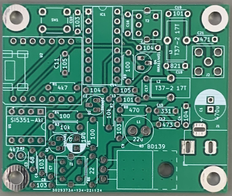
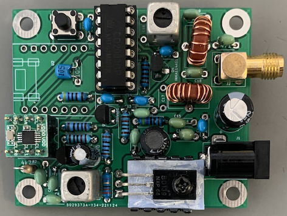
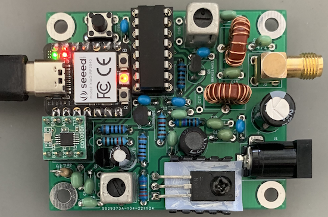
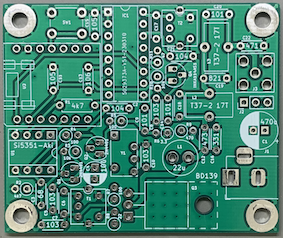
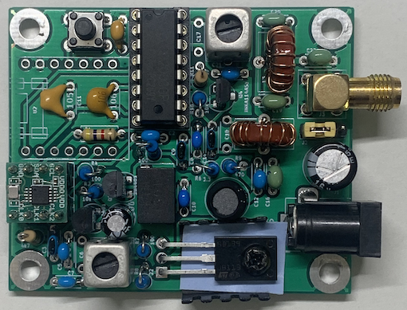
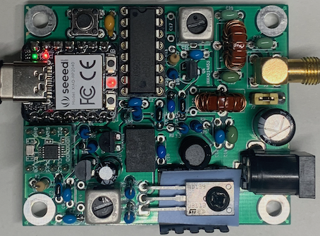

# QP-7C（CRkits共同購入プロジェクト）の改造　II （RP2040を使用）

 CRkits共同購入プロジェクトで頒布されているQP-7Cミニ送信機キット（http://jl1kra.sakura.ne.jp/QP-7C.html) の改造を行っています．  
 ”QP-7C（CRkits共同購入プロジェクト）の改造”(https://github.com/je1rav/QP-7C/) の続きですが，これまでと違うCPUを使っていること，ソフトウェアを含めて開発中なことを考えて別レポジトリーにしました．  
 これまでの経緯などは(https://github.com/je1rav/QP-7C/) をご覧ください． また，そちらも引き続き更新する予定です．  
 
## QP-7Cミニ送信機とRP2040を使ったデジタルモードトランシーバー
今回は，シンプルなデジタルモード専用トランシーバーに改造しました．  
送信部は，これまで通りQP-7Cミニ送信機＋Si5351aです．   
受信部は，”Ein FT8-QRP-Transceiver”やF5NPVのFT8QRP，WB2CBAのADXなどと同じCD2003GP(TA2003P互換)を使ったダイレクトコンバージョン方式です．  
これらとの違いはコントロールにラズパイpicoのCPUであるRP2040を使用し，PCとの接続をUSBケーブル1本にしたことです．  
これは，QRP LabsのQDXやJA6IRKさんの"ダイレクトFSKデジタルトランシーバー"に類似した形式です．  
まだ，いろいろな問題がありますが，とりあえず使えなくはないレベルになったと思いますので，公開します．  

### RP2040使用の経緯
QRP LabsのQDXは，32bitCPU(STM32F401)を使用して，USBを使ってPCと音響信号のやりとりしています．  
また，受信はIQミキサーで得た音響信号を48kHz，24bitのステレオADコンバーターを使ってデジタル化し，信号処理したあとでUSB経由で送っています．  
さらに，USBでCAT制御も行っており，USBケーブル1本でPCと繋がる素晴らしいデジタルトランシーバーキットです（しかも5W,3バンド対応）．  
似たようなものを”Ardiuno Nano”互換機で作ろうとしても，音響信号をUSBでやりとりするのは困難で，USBインターフェイスを持つCPUが必要です．  
利用できそうなものはATmega32U4ですが，Arduino IDEのLibraryがあまり整理されていないようで，気軽にプログラミングするのは大変そうでした．  
TeensyシリーズはArduino IDEでプログラミングでき，高性能なのですが，少し高価で，なおかつ現在は品薄のようです．  
QDXでも使われているSTM32系統のCPUについては，mbedボードを使用すれば，なんとかプログラミングできる可能性はありそうですが，こちらも品薄のようです．  

一方，インターフェイス誌2022年10月号に，ラズパイpicoを使ったUSB機器の特集がありました．  
ラズパイpicoも32bitCPU(RP2040)を持っており，こちらは安価で入手も容易です．  
また，高速の12bitADコンバーターを持っているのでこれも使用できそうです．  
現時点で，RP2040のADコンバーターにはバグが報告されていますが，今回の目的には大きな問題にはならないと考えました．  
インターフェイス誌の解説どおりに開発を行うには開発環境を整備する必要があって，普段使っているArduino IDEではありません．  
ラズパイpicoもArduino IDEでTinyUSBを使った開発も可能ですが，USBオーディオのプログラム例がなかなか見つかりませんでした．  
そうこうしていると，githubで"Pico-USB-audio"というプロジェクトを見つけました．  
https://github.com/tierneytim/Pico-USB-audio  
これは，PCからUSBオーディオ経由でラズパイpicoに音響信号をおくり，ラズパイpicoでPDM変調させてスピーカーから音をながすというものです．  
同プロジェクトのプログラム例には，ラズパイpicoからPCにUSB経由で音響信号を送るものもありました．  
このプラグラムは，Arduino IDEで開発されており，pico用ボードマネジャー”Arduino Mbed OS RP2040 Boards”で使用できます．  
このプラグラムの主要部分であるPDM変調は今回は必要ないのですが，このプログラムのUSBオーディオ通信部分を参考にして，ラズパイpicoを使用したUSBオーディオインターフェイスを構築することを考えました．  

QRP LabsのQDXでは，USBで音響信号転送，シリアル通信，ストレージ機構を同時に実現しています．  
今回参考にするプログラムでは，USBは音響信号転送専用で使用し，シリアル通信機能は同時には使えません．  
USBオーディオとシリアル通信の複合デバイスを構成するコードを書くのは，現時点で私には無理なので，今回は音響信号の送受信のみにしました．  
将来的には，同時シリアル通信も可能にして，CAT制御ができればと思います．  
ラズパイpicoでも良かったのですが，サイズが一回り小さくカラーLED搭載の”Seeed Xiao RP2040”がラズパイpicoと同程度の価格で売っているので，こちらを使用することにしました．  
ボードマネジャー”Seeed XIAO RP2040”のver2.7.2はArduino Mbed OSベースですので，このプログラムがほぼそのまま使えると考えました．  

オーディオケーブルは不要で，PCとの接続はUSBケーブル1本となります．  
また，受信部の電源はUSBから取っていますので，受信だけなら外部電源は不要です．  
シンプルなデジタルモード専用トランシーバーで，モノバンドとし，ディスプレイやロータリーエンコーダはありません．  
周波数の切り替えは，将来的にはCAT制御を目指すものの，とりあえずあらかじめセットしたいくつかの周波数をタクトスイッチで順に切り替える事とし，その情報はLEDの色で判別することにしました．  

### 回路図およびプリント基板
回路図は，  
  
プリント基板は，Kicadを使って作成しました．  
   
送信部は基本的に「QP-7Cミニ送信機の改造（その4）」などと同じですが，モノバンド仕様でソケット方式ではありません．  
USBオーディオでPCから音響信号を受け，その周波数を解析し，それをもとにSi5351aでFSK信号を発生させていますので，基本的にはQDXと同じだと思います．  
受信部は”Ein FT8-QRP-Transceiver”などと同じですが，QP-7Cミニ送信機キットのDIY-7が余っているので入力トランスとして使用しました．  
受信切り替えは，ゲート閾値電圧の低いMOS-FET(INKA114AS1-T112)を使用しましたが，BS170でも良かったかも知れません(足の配置が違うので差し替えには注意が必要)．　  
受信はSi5351aを局発とし，CD2003GP(TA2003P)をダイレクトコンバージョンで使用し，音響出力(AM MIX OUTPUT)をRP2040のアナログ入力A0ピンに入力しています．  
CD2003GPの"AM MIX OUTPUT"は0.6VのDCオフセットを持っていますので，そのままRP2040のADコンバーターに接続しました．  
AD変換した信号はUSBオーディオでPCに送っています．  

QP-7CキットのDIY7の代わりにFCZコイルを使用して他のバンド用に製作する場合のために同調用コンデンサー(c7,c16)を回路図と基板に加えています．  
(QP-7Cキットを使用して，7MHzで作製する場合は，取り付け不要です.)  
出力用LPFの第一段目にも並列共振用コンデンサーを取り付けて高調波スプリアスをさらに減らしたい場合を考えて，回路図と基板にコンデンサー(c17)を加えています．  
(QP-7Cキットを使用して，7MHzでそのまま作る場合は，取り付け不要です.)  

部品をつけた状態．  
  
 

#### Kicadのファイルは"QP-7C_RP2040_kicad.zip"で，ガーバーファイル(JLCPCB用)は"QP-7C_RP2040_gerber.zip"です．  
	今回は，JLCPCBで基板作成を行いました(5枚で$2.00，最安送料$1.01，2022年12月1日現在)． 

### ファームウェア
#### Seeed XIAO RP2040用のArduino IDEスケッチは"QP-7C_RP2040_rev1.ino"です．  
	Seeed XIAO RP2040のボードマネージャーは，”Seeed XIAO RP2040”ver2.7.2 を使いました． 
	Arduino IDEのpreference中の追加ボードマネージャのURLに以下のアドレスを追加すると，Arduino IDEのボードマネージャーからインストールできます． 
	https://files.seeedstudio.com/arduino/package_seeeduino_boards_index.json
	SI5351aの制御には，"Etherkit SI5351"ライブラリーを使用しました． 
	オンボードのカラーLEDの制御には，"Adafruit_NeoPixel"ライブラリーを使用しました． 

今回．音響信号は，48kHzでサンプリングされています．  
このサンプリングされた信号からデジタル通信用の音響信号の周波数を決定しないといけません．  
”Ein FT8-QRP-Transceiver”などでは，ATmega328pのアナログコンパレーターとタイマーを使用して，1uS以下の分解能でコンパレーターによる周期測定を行なっています．  
レシプロカルカウンター方式の周波数カウンターで，低周波数の信号の周波数を正確に決定できます．  
この場合でも，1000Hz程度以上では精度が落ちると考え，これまでの「QP-7Cミニ送信機の改造」では，3サイクルで周期測定を行なっていました．  
一方，今回の場合，例えば48kHzサンプリングでのサンプリング間隔は20.83uSと長いですので，正確な周期測定には工夫が必要です．  
ただ単にコンパレーターとして使用すると， 500Hzで5Hz程度，1kHzで20Hz程度，3kHzで200Hz程度の精度でしか決定できません．  
飛び飛びの時間間隔でサンプリングされたデータから信号が0を通過する時刻を正確に見積ることが必要です．  
このための方法は，QRP LabsのQDXのマニュアルに詳しく解説されています．  
http://qrp-labs.com/qdx.html  
これには，音響信号がsin波であること，正確な時間間隔での波形データが得られていることを利用します．  
0付近のsin関数は，y=x-x*x*x/6+x*x*x*x*x/120-...のようにテイラー展開できます．  
0のごく近くなら，y=xで近似できるので，データの値が0を横切った時に，その前後の値からの比例配分で，0を横切る時刻を正確にかつ簡単に算出できます．  
周波数が高めの例えば3kHzの音響信号は，48kHzサンプリングでは1周期の信号が16点で現されることになり，サンプリング間隔が少し粗くなっていることが懸念されます．  
この場合，データの値が0を横切る前後の点の位相は，0を横切る点から最大で22.5°=0.39radずれますので，第2項（xの3次項）まで考慮した方がよいかも知れません．  
このためのプログラムも書いたのですが，結果的にはy=xの近似で問題ありませんでした．  

送信用には24サンプリング毎（2kHz,0.5ms）にPCからデータを読み取って信号処理しましたが，Si5351aに周波数データを送る頻度についてはある程度の時間間隔をとる必要がありました．  
送信周波数の変化が比較的遅いので，あまり早い通信速度には対応できません．  
FT8は6.25ボー，FT4は約20ボーで，これらのデジタルモードには対応できます．  
	
受信時は，CD2003GPからの音響信号をRP2040のADコンバータでデジタル信号に変え，USBオーディオ経由でPCに送っています．  
<del>ADコンバータのサンプリング間隔は，PCからのUSBオーディオデータの受信でタイミングをとっています．  
PCからのデータを6サンプリング毎（8kHzに対応）に読み取ることで，8kHzのタイミングを作成し， ADコンバータで8kHzでサンプリングしてデータを得ました．  
ADコンバータ自体はもっと高速ですので，1回のデータを得るのに出来るだけ数多くサンプリング（13回）して合計しています．  
この数が多いほど受信感度が上がり，また，後述のゴースト信号の抑圧にも影響しました．  
(受信信号のサンプリング間隔を変える（48kHz, 24kHzなど）ことも可能ですが，今回は上記のようにしています．)  
ADコンバータはQDXよりもかなり低分解能ですが，受信感度はQRPデジタルトランシーバーとしては，使えるレベルだと思います．  
現時点で原因がよく分かっていないのですが，nkHz(nは整数)に弱いノイズが観測され，さらに強い信号の±1kHz,±2kHz離れたところにゴーストが受信されました．  
ゴーストの強度は，-1kHzで-10dB程度以下,-2kHzは-20dB程度以下,+1kHzで-20dB程度以下,+2kHzは-30dB程度以下でした．  
さらに，丁度nkHz(nは整数)に対する対称側（例えば800Hzであれば1200Hz）にも-20dB程度以下程度のゴーストが生じました．  
強い信号がある時はゴーストがいろいろな箇所に観測され，スペクトル表示画面が混雑して見えるのですが，デコードについてはなんとか許容できる程度と思います．  
（ADコンバータのサンプリング間隔をPCからのUSBオーディオデータの受信でタイミングをとっているのが原因かもしれません．） </del>  
上記の消し線で示した記述は初期のファームウェア"QP-7C_RP2040.ino"に対するものです．  
現在のファームウェア"QP-7C_RP2040_rev1.ino"については，下記の”QP-7Cミニ送信機とRP2040を使ったデジタルモードトランシーバーの追加（2022/12/27）”の項をご参照ください．  

プリセットする受信RF周波数の数は，プログラム中の"#define N_FREQ x"のxで設定しています(色の都合で現在7個まで使用できます)．  
それぞれの周波数は，extern int64_t Freq_table[N_FREQ]={,,}文で設定します．  
現在の"QP-7C_RP2040.ino"では，7041000Hzと7074000Hzの2周波数が使えるようになっています．  
周波数表示は，NeoPixel LEDで赤(0),緑(1),青(2),黄色(3),シアン(4),マゼンダ(5),白(6)としています．  
また，オンボードの別のユーザーLEDを用い，受信時には緑，送信時には赤に点灯するようにしました．  

PCに接続すると, USBオーディオとして”Mbed Audio"が現れますので，WSJT-Xなどのデジタルモードアプリでこれをオーディオ入出力に設定して使って下さい．  
ステレオ（左，右のどちらでも）でもモノラルでも問題ありません．  
デジタルモードアプリの音響出力は最大にセットしてください．  
FT8については交信可能なことを確かめましたが，FT4については確かめていません．  
これまでの経験から，12V電源の代わりにUSBからの5Vを繋げると，追加電源なしで7MHz帯で0.2Wの出力が出るかも知れません（未検証）．  

### 必要部品(2022年12月1日時点の価格)  
	QP-7Cキット：CRkits共同購入プロジェクト，1820円 + 180円（送料）　http://jl1kra.sakura.ne.jp/QP-7C.html  
	CD2003GP：たとえばaitendo，150円　https://www.aitendo.com/product/1528
	Seeed Xiao RP2040：たとえば秋月電子 830円　https://akizukidenshi.com/catalog/g/gM-17044/   
	秋月電子Si5351モジュール：秋月電子，500円　https://akizukidenshi.com/catalog/g/gK-10679/  
	INKA114AS1-T112(Tx-Rx切替用)：1個　秋月電子，40円　https://akizukidenshi.com/catalog/g/gI-14775/
	2.1ｍｍ標準ＤＣジャック 基板取付用MJ-179PHＭ：秋月電子，40円　https://akizukidenshi.com/catalog/g/gC-06568/  
	タクトスイッチ：秋月電子，15円　https://akizukidenshi.com/catalog/g/gP-17166/
	16ピンICソケット（CD2003GP用）：1個
	コンデンサ470μF(電源用）：1個（電解コンデンサー）  
	コンデンサ105（INKA114AS1-T112用，電源用など）： 2個（積層セラミックコンデンサー）    　　
	コンデンサ104（CD2003のAM/FM切り替え端子用，電源用など）： 3個（積層セラミックコンデンサー）    　　
	抵抗　10kΩ(INKA114AS1-T112用）：1個    　　
	抵抗　100Ω(CD2003局発注入用）：1個  

## QP-7Cミニ送信機とRP2040を使ったデジタルモードトランシーバーの追加（2022/12/27）
### ファームウェアのアップデート（受信時のゴースト除去）

最初のプログラムでは，ADコンバータのサンプリングについて，PCからのUSBオーディオデータの受信でタイミングをとっていました．  
この時，強い信号の±1kHz,±2kHz離れたところやnkHz(nは整数)に対する反対側（例えば800Hzであれば1200Hz）などに受信信号のゴーストが現れていました．  
この原因は，ADコンバータのサンプリング間隔をPCからのUSBオーディオデータの受信でタイミングをとっていたためでした．  
ADコンバータのサンプリング間隔をプログラムで指定することが可能ですので，プログラムを修正しました．  
この結果，問題のゴーストは消失しました．  
USBは1ms毎のフレーム構造になっているようで，そのフレームの開始と終了を表す信号などを1ms毎に通信しているようです．  
このために，ADコンバータのサンプリングのタイミングが1kHzで変調を受けていたものと思われます．  
今回，ADコンバータのサンプリングは192kHzのフリーランで行い，そのデータをFIFOに書き込んでいます．  
そのデータを24回読み込むことで，192kHz/24 = 8 kHzのタイミングを生成し，USB Audioに出力しています．  
USB Audioは48 kHzサンプリングなので，8 kHzでサンプリングした同じデータを6回書き込んでいます．  
このため，使用可能な音響最高周波数は4 kHzですが， デジタルモードで3 kHz以上は使わないので，問題ありません．  
192kHz/4 = 48 kHzとしなかったのは，高周波成分の信号よりも受信感度を重視したためです．  
Seeed XIAO RP2040用のArduino IDEスケッチの改良版は"QP-7C_RP2040_rev1.ino"です．  
プログラムの変更自体は軽微ですが，プログラムの基本的な考え方が変わったので，別名でアップします．  
プログラムの問題点についてコメント，ご助言いただいたJG2CEZ OMに感謝いたします．  

## QP-7Cミニ送信機とRP2040を使ったデジタルモードトランシーバーの追加2（2023/1/11）
### ファームウェアのアップデート（バグフィックス）

送信時にPCからのオーディオ信号を変換して，その周波数を算出する部分にバグがあり，条件によって正しく周波数を算出しない問題がありましたので，修正しました．  
修正は，”QP-7C_RP2040_rev1.ino”について行っています．  
プログラム動作の問題点についてご指摘していただき，プログラム修正にご協力いただいたJA6IRK OMに感謝いたします．  

## QP-7Cミニ送信機とRP2040を使ったデジタルモードトランシーバーの追加3(2023/1/13)
### ファームウェアのアップデート

”QP-7C_RP2040_rev1.ino”について，送信終了時の挙動の適正化，細かなバグの修正，ルーチンの整理などを行いました．

## QP-7Cミニ送信機とRP2040を使ったデジタルモードトランシーバーの追加4(2023/1/31)
### ファームウェアのアップデート（QP-7C_RP2040_rev1.ino）

USBAudioのread()文の挙動に合わせたプログラム修正を行いました(Tnx. JG2CEZ)．  
コメント文（ピン番号）の間違いを修正しました(Tnx. JH4VAJ)．  
いくつかのバグ（特に送信終了時の処理のミス）について修正を行いました．  
追加の修正を行いました　(JST 18:55)．  

## QP-7Cミニ送信機とRP2040を使ったデジタルモードトランシーバーの追加5(2023/2/2)
### ファームウェアのアップデート（QP-7C_RP2040_rev1.ino）

送信時にADコンバーターのフリーランを止めるようにプログラム修正を行いました(Tnx. JG2CEZ)．  
コメント文などのtypoを修正しました(Tnx. JG2CEZ)．  
receive()文について，処理ルーチンの整理を行いました．  

## QP-7Cミニ送信機とRP2040を使ったデジタルモードトランシーバーの追加6(2023/2/4)
プログラムのコンパイル時に注意が必要なようです．　jh4vaj OMのwebページをご参照ください．  
https://www.jh4vaj.com/archives/37814

## QP-7Cミニ送信機とRP2040を使ったデジタルモードトランシーバー の追加7(2023/4/6)   
### プログラムのコンパイルについて(ボードマネージャー”Seeed XIAO RP2040”は開発中止)   
Seeed XIAO RP2040のボードマネージャー”Seeed XIAO RP2040”が開発中止となり，Arduino IDEの1.8.19などでは，インストールできなくなっています．   
Seeedの公式ページではArduino IDEで”Raspberry Pi Pico/RP2040”を使えと指示していますが，これはMbedベースではなく，このプログラムは動きません．   

一方で，Raspberry Pi Pico用の公式ボードマネージャー”Arduino Mbed OS RP2040 Boards”は，開発が続いていますので，
”Seeed XIAO RP2040”の代わりに，こちらのボードマネージャーを使うことが考えられます．   
しかし，大きな問題があります．   
”Seeed XIAO RP2040” ver2.7.2では，I2Cに使用するピンが6番ピンと7番ピンなのに対して，
現在の”Arduino Mbed OS RP2040 Boards”でI2Cに使用するピンは，デフォルトで4番ピン，5番ピンとなっています．   
（残念なことにSeeed XIAO RP2040では5番ピンは外部に引き出されていません．）   
そのため，このプログラムはボードマネージャー”Arduino Mbed OS RP2040 Boards”でコンパイルすることは可能ですが，I2Cに使用するピンが違うのでうまく作動しません．   
また，このボードマネージャーの開発者は，ユーザーがプログラム中でI2Cに使用するピンを自由に変えることができるようにする気はないようです．   
Wireの代わりにWire1を使えば，6番ピンと7番ピンをI2Cで使えますが，使用しているライブラリーがWire1に対応していません．   
これを回避して，Seeed XIAO RP2040で使用するには，ボードマネージャー”Arduino Mbed OS RP2040 Boards”自身のファイルの一部分を書き換える必要があります．   
これにより，ボードマネージャー”Arduino Mbed OS RP2040 Boards”を使ってコンパイルし，Seeed XIAO RP2040で作動させることが出来るようになります．   
例えばMAC OSのArduino IDEの1.8.19では,   
“/Users/ユーザー名/Library/Arduino15/packages/arduino/hardware/mbed_rp2040/4.0.2/variants/RASPBERRY_PI_PICO/pins_arduino.h”   
WINDOWSのArduino IDEの1.8.19のインストーラ版では,  
“C:\Users\ユーザー名\AppData\Local\Arduino15\packages\arduino\hardware\mbed_rp2040\4.0.2\variants\RASPBERRY_PI_PICO\pins_arduino.h”   
にある”pins_arduino.h”ファイルの中身を一部書き換えます．   
ここで，”4.0.2”はボードマネージャーのヴァージョンを示しています．   

”pins_arduino.h”は使用するピンの指定やピンの名前付けなどの設定ファイル（ヘッダーファイル）です．   
このファイルの   
// Wire   
#define PIN_WIRE_SDA        (4u)   
#define PIN_WIRE_SCL        (5u)   
の部分を   
// Wire   
#define PIN_WIRE_SDA        (6u)   
#define PIN_WIRE_SCL        (7u)   
に変更します．   
これは，I2Cで使用するSDAピンとSCLピンについて，それぞれ4番ピンと5番ピンだったのを，6番ピンと7番ピンに変更することを意味します．   
この変更によって，Seeed XIAO RP2040で使用できるようになります．   
ファイルを書き換えた後は，Arduino IDEを再立ち上げして，ファイルの変更が確実に有効になってからコンパイルすると良いでしょう．   

## QP-7Cミニ送信機とRP2040を使ったデジタルモードトランシーバー の追加8(2023/4/11)   
### 受信部のスーパーヘテロダイン化   
受信部を，”https://github.com/je1rav/QP-7C QP-7Cミニ送信機の改造（その5）”と同様にスーパーヘテロダイン化しました．  
ダイレクトコンバージョン版と比較して，少し部品は増えましたが，感度が上昇し，nkHz(n=1,2,3)に現れていたノイズが見えなくなりました．  
放送波の通り抜けも減少していると思われます．  
それ以外は，ダイレクトコンバージョン版と同じですので，使用法などはそちらを参照してください．  

#### 回路図およびプリント基板
回路図は，  
  
セラミックフィルターは1段にしました．  
受信はSi5351aを局発とし，CD2003GP(TA2003P)をスーパーヘテロダインで使用し，中間周波セラミックフィルター1段を通過後にBFO信号を注入しています．  
検波後の音響出力(DET_OUT)をRP2040のアナログ入力A0ピンに入力しています．  
送信部電源をUSB（5V）からか,あるいは外部電源からか選べるようにピンをつけました．  
基板の写真  
   
部品をつけた状態  
  
 

#### プリント基板の Kicadのファイルは"QP-7C_RP2040_super_kicad.zip"で，ガーバーファイル(JLCPCB用)は"QP-7C_RP2040_super_gerber.zip"です．  

#### Seeed XIAO RP2040用のArduino IDEスケッチは"QP-7C_RP2040_super.ino"です．  
	ボードマネージャーは，Raspberry Pi Pico用の公式ボードマネージャー”Arduino Mbed OS RP2040 Boards”を使いました． 
	“QP-7Cミニ送信機とRP2040を使ったデジタルモードトランシーバー の追加7”に記載していますが，Seeed XIAO RP2040用のMbed対応ボードマネージャーは開発中止になり使用できません． 
	このため，止むを得ず”Arduino Mbed OS RP2040 Boards”を使用するのですが，そのままではI2Cが正しく動きません． 
	”Arduino Mbed OS RP2040 Boards”をSeeed XIAO RP2040で使用するには，同ボードマネージャーの中の”pins_arduino.h”ファイルの一部を変更する必要があります． 
	（“QP-7Cミニ送信機とRP2040を使ったデジタルモードトランシーバー の追加7”を参照してください．）   

#### プログラムのSi5351aの発振周波数，BFO周波数の調整．
	"https://github.com/je1rav/QP-7C QP-7Cミニ送信機の改造（その5）"を参考にして，調整して下さい． 

#### 必要部品(2022年3月1日時点の価格)  
	QP-7Cキット：CRkits共同購入プロジェクト，1820円 + 180円（送料）　http://jl1kra.sakura.ne.jp/QP-7C.html  
	CD2003GP：たとえばaitendo，150円　https://www.aitendo.com/product/1528
	Seeed Xiao RP2040：たとえば秋月電子 830円　https://akizukidenshi.com/catalog/g/gM-17044/   
	秋月電子Si5351モジュール：秋月電子，500円　https://akizukidenshi.com/catalog/g/gK-10679/  
	LTM455IW or LTM450IW：2個　秋月電子，1個110円(LTM455IW) or 10個300円(LTM450IW) https://akizukidenshi.com/catalog/g/gP-16374/ or https://akizukidenshi.com/catalog/g/gP-16052/
	INKA114AS1-T112(Tx-Rx切替用)：1個　秋月電子，40円　https://akizukidenshi.com/catalog/g/gI-14775/
	2.1ｍｍ標準ＤＣジャック 基板取付用MJ-179PHＭ：秋月電子，40円　https://akizukidenshi.com/catalog/g/gC-06568/  
	タクトスイッチ：秋月電子，15円　https://akizukidenshi.com/catalog/g/gP-17166/
	16ピンICソケット（CD2003GP用）：1個
	コンデンサ470μF(電源用）：1個（電解コンデンサー）  
	コンデンサ106（CD2003のAGC用）： 1個（積層セラミックコンデンサー）    　　
	コンデンサ105（INKA114AS1-T112用，電源用など）： 2個（積層セラミックコンデンサー）    　　
	コンデンサ104（CD2003のAM/FM切り替え端子用，電源用など）： 3個（積層セラミックコンデンサー）    　　
	抵抗　10kΩ(INKA114AS1-T112用）：1個    　　
	抵抗　47Ω(CD2003局発注入用）：1個  
	抵抗　100Ω(CD2003 BFO注入用）：1個  
	抵抗　3.3Ω(CD2003 BFO注入用）：1個  
	ピンヘッダー，ショートピン

## QP-7Cミニ送信機とRP2040を使ったデジタルモードトランシーバー の追加9(2023/4/12)   
###  スーパーヘテロダイン用ファームウェア"QP-7C_RP2040_super.ino"のアップデート（バグフィックス）
送信時に高周波出力が出ないバグを直しました．  

## QP-7Cミニ送信機とRP2040を使ったデジタルモードトランシーバー の追加10(2023/5/15)   
###  CAT(リモートコントロール)対応ファームウェアの別レポジトリーでの公開
https://github.com/je1rav/QP-7C_RP2040_CAT
